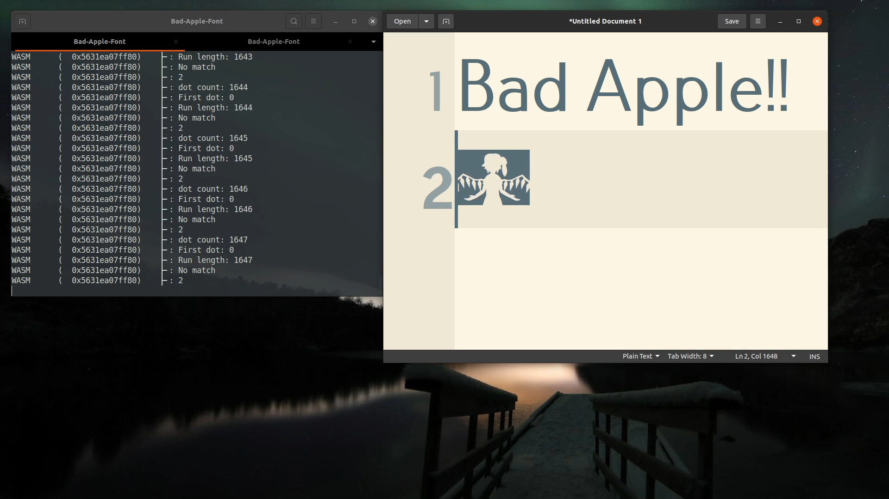

# Bad-Apple-Font

Playing Bad Apple!! using [HarfBuzz WASM shaper](https://github.com/harfbuzz/harfbuzz/blob/main/docs/wasm-shaper.md) within any editable area.

**Check out more abusement of WASM shaper at [hsfzxjy/Harfbuzz-WASM-Fantasy](https://github.com/hsfzxjy/Harfbuzz-WASM-Fantasy)!**

> **NOTE** [_Valdemar Erk_](https://blog.erk.dev/) is credited as the original proposer of this idea, who wrote the first [blog post](https://blog.erk.dev/posts/anifont/) and uploaded the first [video on Youtube](https://www.youtube.com/watch?v=GF2sn2DXjlA) as demonstration.

[Play on Youtube](https://www.youtube.com/embed/qFd8vsr8nag) | [Play on Bilibili](https://www.bilibili.com/video/BV1SP411Y7Dr)



Some days ago I read a thread titled ["BadAppleFont"](https://blog.erk.dev/posts/anifont/) on [HackerNews](https://news.ycombinator.com/item?id=37317055). The post described an interesting abusement of the experimental [HarfBuzz WASM shaper](https://github.com/harfbuzz/harfbuzz/blob/main/docs/wasm-shaper.md) to play "Bad Apple!!" in theoretically any editable areas. Nonetheless, the post lacked sufficiently specific instructions or code snippets to rebuild the artwork, which is regrettable.

This repository aims to offer a pipeline to simplify the replication of the idea. To build your own BadAppleFont and apply onto arbitary applications, all you need is to follow these instructions.

## Prerequisites

This project has been developed and tested on Ubuntu 20.04 (amd64). While it may function on other platforms, compatibility is not guaranteed.

First, clone this project to your local machine and update all sub-modules:

```bash
git clone https://github.com/hsfzxjy/Bad-Apple-Font
git submodule update --init --recursive
```

Before we start, make sure the following commands are globally available:

```plaintext
python3 cmake g++ wget tar ffmpeg cargo rustup
```

> **NOTE** This list may not be exhausted. Feel free to contribute if you find something missing.

In addition, make sure to have a good network condition, since we will download a lot of stuff from Github, Niconico, etc.

## Building

The entire build process is partitioned into 7 steps, each corresponding to a directory:

- **01_Download_Video**: Download the original video from Niconico.
- **02_Extract_Frames**: Extract all frames from the video and store as BMP files.
- **03_Vectorization**: Convert all extracted BMP files into SVG files.
- **04_Make_Font**: Convert all SVG files into strokes and stuff them into an `.sfd` file.
- **05_WASM**: Build the WASM shaper binary (make sure Rust toolchain installed and `cargo` is available).
- **06_HarfBuzz**: Build a customized copy of `libharfbuzz` to enable experimental WASM shaper.
- **07_Install_Font**: Build the OpenType font from the `.sfd` and `.wasm` file. Install it to `~/.local/share/fonts/`.

To run the above steps in sequence, execute `./make.sh` as follows:

```shell
$ ./make.sh
...output omitted...
ALL DONE!!!
```

If you see a line of `ALL DONE!!!` at the tail, the font and `libharfbuzz` should be ready. Congratulations!

## Hacking

To enable WASM shaper for an application, use the `./hack` script. For example, if you want to play "Bad Apple!!" in `gedit`, simply run:

```bash
./hack gedit
```

Then go to `Preferences -> Font & Colors -> Editor font`, pick a font with name `Pfennig Medium` and confirm. Your editor is now ready to play the video. Press and hold key <kbd>.</kbd> and you will see the animation.

## LICENSE

This repository is licensed under the [MIT LICENSE](./LICENSE).
